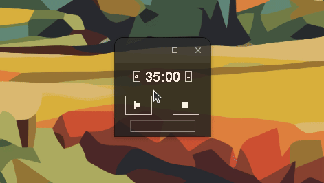

Simple Pomodoro Timer
======================

A simple and customizable Pomodoro timer built with Python using Tkinter for the interface and pygame for sounds.



Features
---------------

- Start, pause, and reset the timer.
- Rain sound with customizable volume while the timer is running.
- Notification sound when the timer ends.

Getting Started
---------------

1. Clone the repository
2. Install the required packages:
   ```
   pip install pygame
   sudo apt install python3-tk
   ```
3. Run the application:
   ```
   python3 __main__.py
   ```
